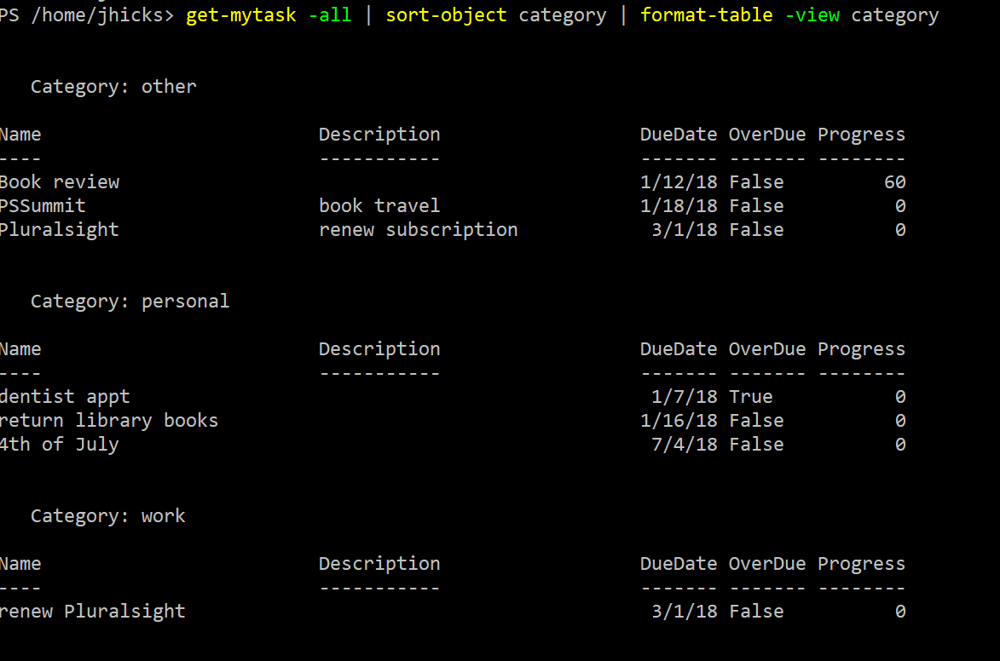

# MyTasks

This PowerShell module is designed as a task or simple To-Do manager. The module contains several commands for working with tasks. It should work with both Windows PowerShell and PowerShell Core. You can install the latest version from the PowerShell Gallery. You will need the -Scope parameter for PowerShell Core.

```powershell
Install-Module MyTasks [-scope currentuser]
```

Task data is stored in an XML file. Here are a few highlights.

## Class based

This module requires at least PowerShell version 5.0 since is uses a class definition for the task object. While you could use the object's properties and methods directly, you should use the appropriate module command.

## XML Data

All of the task information is stored in an XML file. The commands in this module will read in, update, and remove items as needed using PowerShell commands such as `Select-XML`. By default these files are stored in your Documents folder (on Windows systems) or in Home (on Linux). You can change the default location by using the `Set-myTaskPath` command. This is helpful if you are sharing task information between laptops via a service like Dropbox.

```powershell
Set-MyTaskPath Drop:\mytasks\
```

If you use this feature, you'll need to make sure you run this command before doing anything. It is recommended to put this command in a PowerShell profile script.

## Categories

The Task object includes a Category property. The module will define a default set of categories, but users can create their own by using the MyTaskCategory commands:

+ Add-MyTaskCategory
+ Get-MyTaskCategory
+ Remove-MyTaskCategory

## Basic Usage

You create a task with at least a name and category. The default due date will be 7 days from the current date and time.

```powershell
New-MyTask "return library books" -Category personal
```

You can also specify a due date.

```powershell
New-MyTask "Pluralsight" -duedate "2/1/2018" -description "renew subscription" -category other
```

You can use `Set-MyTask` to modify a task.

```powershell
Get-MyTask Pluralsight | Set-Mytask -DueDate 3/1/2018
```

Because the task has a Progress property, you can use `Set-MyTask` to update that as well.

```powershell
Set-Mytask "book review" -Progress 60
```

To view tasks you can use `Get-MyTask`. Normally, you will use `Get-MyTask` to display tasks, all, some or a single item:

```powershell
PS S:\> get-mytask -name MemoryTools

ID  Name         Description                DueDate OverDue Category  Progress
--  ----         -----------                ------- ------- --------  --------
8   MemoryTools  update module            7/22/2018 False   Projects        10
```

The default behavior is to display incomplete tasks due in the next 30 days. Look at the help for [Get-MyTask](.\docs\Get-MyTask.md) for more information.

There is also a command called `Show-MyTask` which is really nothing more than a wrapper to `Get-MyTask`. The "Show" command will write output directly to the host. Incomplete tasks that are overdue will be displayed in red text. Tasks that will be due in 24 hours will be displayed in yellow. If you select all tasks then completed items will be displayed in green. This command may not work in the PowerShell ISE.


When a task is finished you can mark it as complete.

```powershell
Complete-MyTask -name "order coffee"
```

The task will remain but be marked as 100% complete. You can still see the task when using the -All parameter with `Get-MyTask` or `Show-MyTask`. At some point you might want to remove completed tasks from the master XML file. You can use `Remove-MyTask` to permanently delete them. Or use the `Archive-MyTask` command to move them to an archive xml file.

## Format Views

The module includes a format.ps1xml file that defines a default display when you run `Get-MyTask`. You will get a slightly different set of properties when you run `Get-MyTask | Format-List`. There is also a custom table view called Category which will create a table grouped by the Category property. You should sort the tasks first: `Get-MyTask | Sort-Object Category | Format-Table -view category`.



## Archiving and Removing

Over time your task file might get quite large. Even though the default behavior is to ignore completed tasks, you have an option to archive them to a separate XML file using `Save-MyTask` which has an alias of `Archive-MyTask`:

```powershell
Get-Mytask -Completed | Archive-MyTask
```

There is an option to archive tasks when you run `Complete-MyTask`. There are no commands in this module for working with the archived XML file at this time. Or you can completely delete a task with `Remove-MyTask`.

## Email Reminders

If you are running this module on a Windows platform that includes the PSScheduledJob module, you can create a scheduled PowerShell job that will send you a daily email with tasks that are due in 3 days or less. The default is a plain text message but you can also send it as HTML. Use the `Enable-EmailReminder` command to set up the job.

You should read full help and examples for all commands as well as the [about_MyTasks](./docs/about_MyTasks.md) help file.

+ [Add-MyTaskCategory](./docs/Add-MyTaskCategory.md)
+ [Backup-MyTaskFile](./docs/Backup-MyTaskFile.md)
+ [Complete-MyTask](./docs/Complete-MyTask.md)
+ [Get-MyTask](./docs/Get-MyTask.md)
+ [Get-MyTaskCategory](./docs/Get-MyTaskCategory.md)
+ [New-MyTask](./docs/New-MyTask.md)
+ [Remove-MyTask](./docs/Remove-MyTask.md)
+ [Remove-MyTaskCategory](./docs/Remove-MyTaskCategory.md)
+ [Save-MyTask](./docs/Save-MyTask.md)
+ [Set-MyTask](./docs/Set-MyTask.md)
+ [Show-MyTask](./docs/Show-MyTask.md)
+ [Enable-EmailReminder](./docs/Enable-EmailReminder.md)
+ [Disable-EmailReminder](./docs/Disable-EmailReminder.md)
+ [Get-EmailReminder](./docs/Get-EmailReminder.md)
+ [Set-MyTaskPath](./docs/Set-MyTaskPath.md)

## Limitations

Please post any issues, questions or feature requests in the [Issues](https://github.com/jdhitsolutions/MyTasks/issues) section.

*last updated 22 October 2018*
